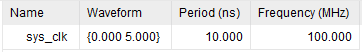
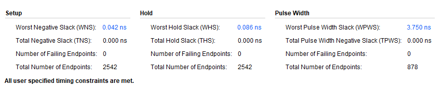
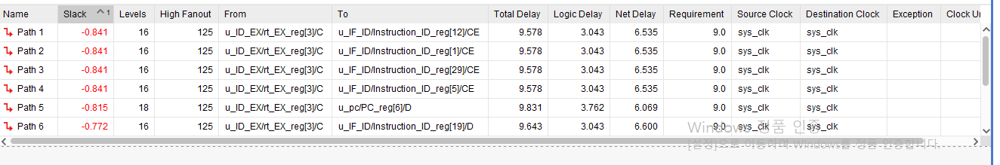
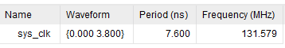
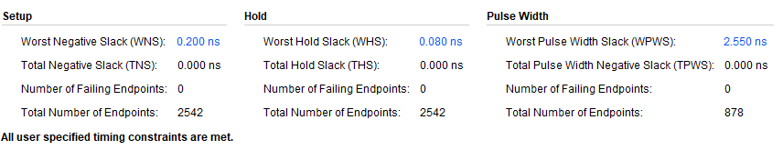

# 32-bit 5-stage Pipeline MIPS CPU

Verilog HDL로 설계한 32-bit 5-stage Pipeline MIPS CPU입니다.

Pipeline 구조와 Hazard 처리 로직을 RTL로 구현하고,
다양한 명령어 조합의 RTL Simulation과 STA를 통해 기능 및 Timing을 검증했습니다.

### 주요 구현 및 성과

- 5-stage Pipeline: `IF / ID / EX / MEM / WB`
- Data Hazard 처리: `Forwarding`, `Load-use Stall`
- Control Hazard 처리: `Branch Flush`, `Jump Flush`
- Hazard 및 Corner Case 기반 RTL Simulation 검증
- STA 기반 Branch Critical Path 분석 및 RTL 구조 개선
- **RTL 구조 개선을 통해 100 MHz에서 131.579 MHz까지 동작 주파수를 높이고, WNS `+0.200 ns`로 Timing 충족**

---

## 개발 환경

| 구분 | 내용 |
|---|---|
| HDL | Verilog HDL |
| Tool | Xilinx Vivado |
| Architecture | 32-bit MIPS |
| Pipeline | IF / ID / EX / MEM / WB |
| 기능 검증 | Vivado Behavioral Simulation |
| Timing 검증 | Static Timing Analysis |
| 목표 주파수 | 100 MHz |

### 지원 명령어

- **R-Type**: `add`, `sub`, `and`, `or`, `slt`
- **I-Type**: `addi`, `lw`, `sw`, `beq`
- **J-Type**: `j`

---

## Pipeline 구조

CPU를 `IF`, `ID`, `EX`, `MEM`, `WB`의 5개 Stage로 구성하고,
각 Stage 사이에 Pipeline Register를 배치했습니다.

| Stage | 주요 기능 |
|---|---|
| IF | Instruction Fetch, PC Update |
| ID | Instruction Decode, Register Read |
| EX | ALU Operation, Branch Decision |
| MEM | Data Memory Access |
| WB | Register Write Back |

### Pipeline 동작 검증

Reset 해제 후 `PC[31:0]`가 `0 → 4 → 8 → 12 → ...` 순서로 증가하는 것을 확인했습니다.

`add $1, $2, $3` 명령어(`0x00430820`)가

`Instruction_IF → Instruction_ID → Instruction_EX → Instruction_MEM → Instruction_WB`

순서로 이동하는 것을 통해 5-stage Pipeline의 동작을 검증했습니다.


---

## RTL Simulation 검증

Hazard가 발생하는 명령어 시퀀스를 구성하고,
Vivado Behavioral Simulation에서 Pipeline 내부 Data Path와 Control Signal을 관측했습니다.

| 구분 | 검증 내용 |
|---|---|
| EX/MEM Forwarding | 직전 명령어의 연산 결과를 다음 명령어가 사용할 때 EX/MEM 값이 ALU 입력으로 전달되는지 검증 |
| MEM/WB Forwarding | 두 명령어 전의 연산 결과를 사용할 때 MEM/WB 값이 ALU 입력으로 전달되는지 검증 |
| Forwarding Priority | EX/MEM과 MEM/WB 조건이 동시에 발생할 때 최신 결과인 EX/MEM 값이 선택되는지 검증 |
| Load-use Hazard | `lw` 직후 Load Data를 사용하는 경우 1-cycle Stall 발생 후 정상적으로 Forwarding되는지 검증 |
| Branch | `beq`의 Taken / Not Taken 동작과 Taken 시 후속 명령어가 Flush되는지 검증 |
| Jump | Jump Target으로 PC가 변경되고 이미 Fetch된 후속 명령어가 Flush되는지 검증 |

---

## Data Hazard

이전 명령어의 결과가 Register File에 반영되기 전에 다음 명령어가 해당 값을 필요로 하는 RAW Hazard를
`Forwarding`과 `Stall` 로직으로 처리했습니다.

일반적인 RAW Hazard는 EX/MEM 또는 MEM/WB의 결과를
EX Stage의 ALU 입력으로 직접 전달하도록 구성했습니다.

- `Forward = 10`: EX/MEM Forwarding
- `Forward = 01`: MEM/WB Forwarding
- 두 조건 동시 발생: EX/MEM 우선

Load-use Hazard는 Forwarding만으로 처리할 수 없어
1-cycle Stall 이후 MEM/WB의 Load Data를 전달하도록 구현했습니다.

---

### 1. EX/MEM Forwarding

**검증 명령어**

```text
add $1, $2, $3  → 0x00430820
sub $4, $1, $3  → 0x00232022
```

`sub`가 EX Stage에 진입할 때 직전 `add`는 MEM Stage에 위치합니다.

**파형 관측**

```text
Instruction_EX      = 0x00232022
Instruction_MEM     = 0x00430820

Write_register_MEM  = 1
rs_EX               = 1
ForwardA            = 10

Read_data1          = 19
Read_data2          = 10
ALU_result           = 9
```

`ForwardA = 10`을 통해 EX/MEM의 결과 `19`가 ALU 입력으로 전달되고,
`19 - 10 = 9`가 출력되는 것을 확인했습니다.


---

### 2. MEM/WB Forwarding

**검증 명령어**

```text
add $1, $2, $3
nop
sub $4, $1, $3
```

`nop`을 삽입하여 `sub`가 EX Stage에 진입할 때
`add`의 결과가 WB Stage에 위치하도록 구성했습니다.

**파형 관측**

```text
Instruction_EX     = 0x00232022

Write_register_MEM = 0
Write_register_WB  = 1
rs_EX              = 1
ForwardA           = 01

Read_data1         = 19
Read_data2         = 10
ALU_result          = 9
```

`ForwardA = 01`을 통해 WB Stage의 결과 `19`가 전달되고,
`ALU_result = 9`가 출력되는 것을 확인했습니다.


---

### 3. Forwarding Priority

EX/MEM과 MEM/WB에 동일한 Destination Register의 결과가 존재할 경우
가장 최근 결과인 EX/MEM 값을 우선하도록 설계했습니다.

**검증 명령어**

```text
add $1, $2, $3
sub $1, $5, $6
add $4, $1, $7
```

```text
첫 번째 add  → $1 = 19
sub           → $1 = 6
마지막 add    → $4 = 6 + 3 = 9
```

**파형 관측**

```text
Write_register_MEM = 1
Write_register_WB  = 1
rs_EX              = 1

ForwardA           = 10

Read_data1         = 6
Read_data2         = 3
ALU_result          = 9
```

두 조건이 동시에 성립한 상황에서 `ForwardA = 10`이 발생하고,
MEM/WB의 이전 값 `19`가 아닌 EX/MEM의 최신 값 `6`이 선택되는 것을 확인했습니다.


---

### 4. Load-use Hazard

**검증 명령어**

```text
lw  $6, 400($0)  → 0x8c060190
add $7, $5, $6   → 0x00a63820
```

Load Data는 MEM Stage 이후에 유효해지므로
바로 다음 명령어에서는 Forwarding만으로 처리할 수 없어,
**1-cycle Stall 후 MEM/WB Forwarding**하도록 구현했습니다.

**Hazard 검출**

```text
Instruction_EX = 0x8c060190
Instruction_ID = 0x00a63820

MemRead_EX     = 1
rt_EX          = 6
rt_ID          = 6
Stall          = 1
```

`lw`의 Destination Register `$6`을 다음 `add`가 사용하면서
`Stall = 1`이 발생하고 PC가 1-cycle 유지되는 것을 확인했습니다.

**Stall 이후 Forwarding**

```text
Write_data_reg_WB = 100
ForwardB          = 1
ALU_result         = 112
```

```text
$5 = 12
$6 = 100

12 + 100 = 112
```

1-cycle Stall 이후 Load Data `100`이 Forwarding되고,
최종적으로 `ALU_result = 112`가 출력되는 것을 확인했습니다.


---

## Control Hazard

Branch와 Jump로 인해 실행 경로가 변경될 경우, 이미 Pipeline에 진입한 잘못된 
후속 명령어를 Flush하여 Control Hazard를 처리했습니다.

- Branch: EX Stage에서 Taken 판정
- Jump: ID Stage에서 Target 결정

---

### 5. Branch Not Taken / Taken

#### Branch Not Taken

**검증 명령어**

```text
beq $10, $11, 4
```

```text
$10 = 4
$11 = 1
```

**파형 관측**

```text
Branch_EX       = 1
Zero            = 0
Branchtaken_EX  = 0

Flush_IF_ID     = 0
Flush_ID_EX     = 0

PC              = 40
Next_PC         = 44
```

Branch 조건이 성립하지 않아 Flush 없이
다음 PC로 순차 실행되는 것을 확인했습니다.


---

#### Branch Taken

**검증 명령어**

```text
beq $10, $10, 4
```

**파형 관측**

```text
Branch_EX       = 1
Zero            = 1
Branchtaken_EX  = 1

Flush_IF_ID     = 1
Flush_ID_EX     = 1

PC              = 52
Next_PC         = 64
```

Branch Taken이 확정되면 IF/ID와 ID/EX에 진입한 후속 명령어를 Flush하고,
`Next_PC = 64`로 Branch Target이 선택되는 것을 확인했습니다.


---

### 6. Jump

Jump는 ID Stage에서 Target을 결정하고,
이미 IF Stage에 진입한 명령어를 Flush하도록 구현했습니다.

**검증 명령어**

```text
j 20
```

**파형 관측**

```text
Instruction_ID = 0x08000014

Jump           = 1
Flush_IF_ID    = 1
Flush_ID_EX    = 0

PC             = 72
Next_PC        = 80
```

`Flush_IF_ID = 1`을 통해 후속 명령어가 제거되고,
`Next_PC = 80`으로 Jump Target이 선택되는 것을 확인했습니다.


---

## Static Timing Analysis 및 Timing 최적화

RTL Simulation을 통한 기능 검증 이후 Clock Constraint를 설정하고
STA를 통해 Setup Timing을 검증했습니다.

초기 설계는 목표 주파수인 100 MHz에서 Timing을 충족했지만,
WNS가 `+0.042 ns`로 Timing Margin이 거의 없는 상태였습니다.

| 항목 | 초기 설계 |
|---|---:|
| Clock Period | 10.000 ns |
| Clock Frequency | 100.000 MHz |
| WNS | +0.042 ns |
| TNS | 0.000 ns |
| Failing Endpoints | 0 |





---

### Critical Path 분석

더 높은 Clock 조건에서 Setup Timing Violation이 발생하여
Worst Timing Path를 추적했습니다.

분석 결과 Branch 판정 경로가 Critical Path를 형성하고 있음을 확인했습니다.

```text
ID/EX Register
    ↓
Forwarding 비교
    ↓
Forwarding MUX
    ↓
ALU A-B 연산
    ↓
Zero 판정
    ↓
Branch Taken 판정
    ↓
Next_PC MUX
    ↓
PC Register
```

기존에는 Forwarding된 두 ALU 입력값이
ALU 연산과 Zero 판정을 거친 뒤 Branch Taken 신호가 생성되는 구조였습니다.



---

### Branch 판정 로직 개선

Branch 판정을 위해 ALU 연산 결과를 거칠 필요가 없다고 판단하여
비교 경로를 변경했습니다.

**개선 전**

```verilog
wire Branchtaken_EX = Branch_EX && Zero;
```

**개선 후**

```verilog
wire Branchtaken_EX =
    Branch_EX && (forward_data1 == forward_data2);
```

Forwarding이 적용된 두 ALU 입력값을 직접 비교하도록 변경하여
Branch 판정 경로에서 ALU 연산과 Zero 판정을 제거했습니다.

이를 통해 Critical Path의 조합논리 지연을 줄였습니다.

---

### 최종 Timing 결과

RTL 구조 개선 후 Clock Period를 `7.600 ns`로 설정하여
다시 STA를 수행했습니다.

약 `131.579 MHz` 조건에서도 모든 Timing Constraint를 충족했습니다.

| 항목 | 초기 설계 | 최적화 후 |
|---|---:|---:|
| Clock Period | 10.000 ns | 7.600 ns |
| Clock Frequency | 100.000 MHz | 131.579 MHz |
| WNS | +0.042 ns | +0.200 ns |
| TNS | 0.000 ns | 0.000 ns |
| Failing Endpoints | 0 | 0 |





초기 설계는 100 MHz에서 WNS `+0.042 ns`로 Timing Margin이 거의 없었지만,
RTL 구조 개선 후에는 131.579 MHz에서도 WNS `+0.200 ns`로 Timing을 충족했습니다.

---

## 프로젝트 결과

- 32-bit 5-stage Pipeline CPU RTL 설계
- `Forwarding`, `Load-use Stall` 기반 Data Hazard 처리
- `Branch Flush`, `Jump Flush` 기반 Control Hazard 처리
- Hazard 및 Corner Case RTL Simulation 검증
- STA 기반 Branch Critical Path 분석
- Branch 판정 경로의 ALU 연산 및 Zero 판정 제거
- 131.579 MHz에서 WNS `+0.200 ns`로 Timing 충족
