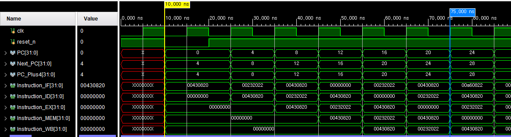
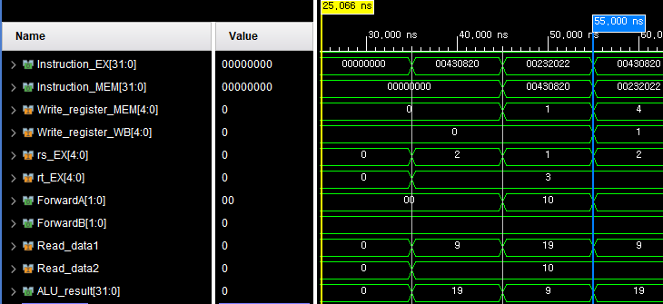
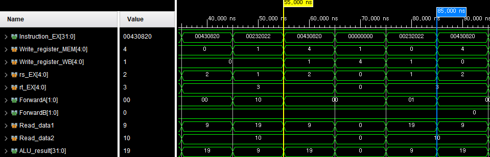
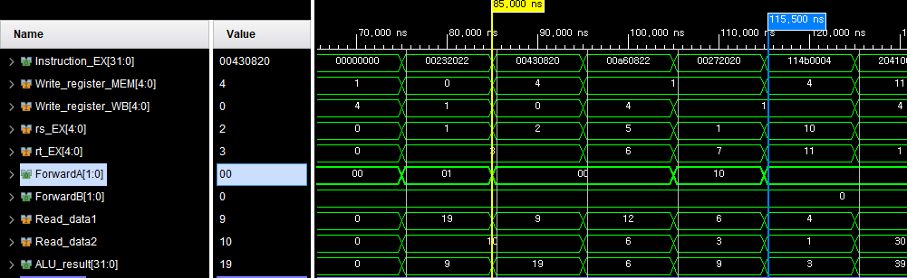
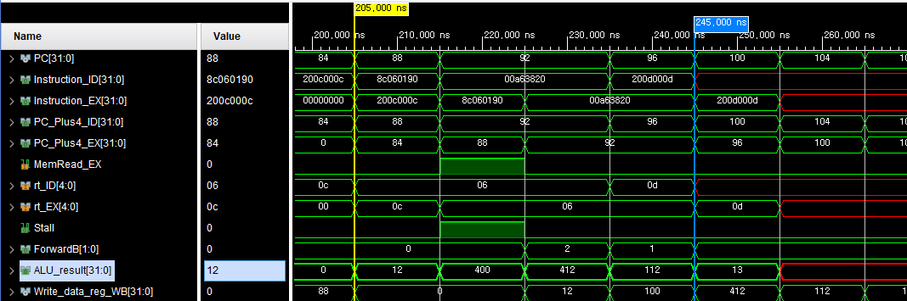
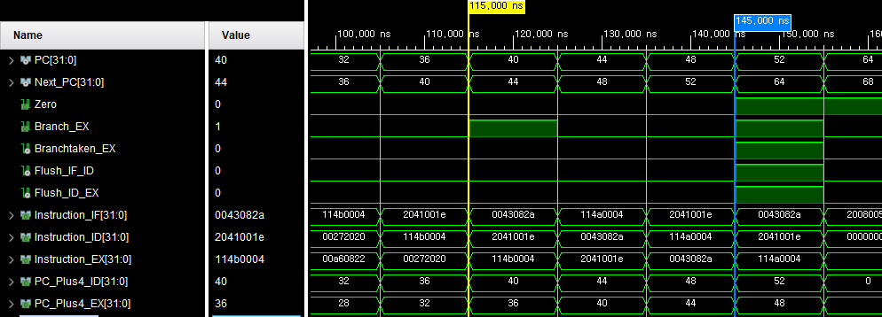
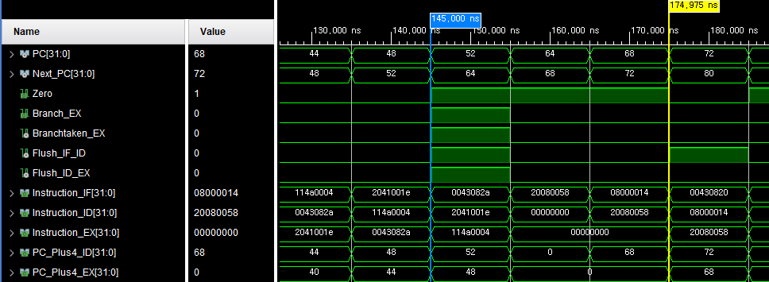
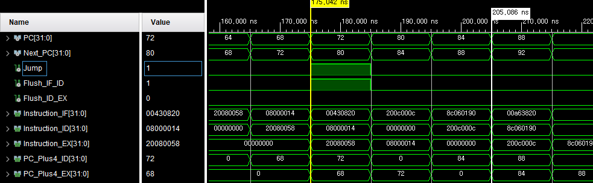

# 32-bit 5-Stage Pipelined MIPS CPU

Verilog HDL 기반의 32-bit 5-stage Pipelined MIPS CPU입니다.

명령어 실행을 IF, ID, EX, MEM, WB의 5개 Stage로 구성하고, Pipeline에서 발생하는 Data Hazard와 Control Hazard를 처리하기 위한 Forwarding, Stall, Flush 로직을 구현했습니다.

Hazard가 발생하는 명령어 시퀀스를 구성하고 Vivado Behavioral Simulation에서 Pipeline 내부 신호와 연산 결과를 검증했습니다. 합성 후에는 Static Timing Analysis를 통해 100 MHz Timing Constraint 만족 여부를 확인했습니다.

---

## Development Environment

| Category | Description |
|---|---|
| HDL | Verilog HDL |
| Tool | Xilinx Vivado |
| Architecture | 32-bit MIPS |
| Pipeline | IF / ID / EX / MEM / WB |
| Verification | Vivado Behavioral Simulation |
| Timing Target | 100 MHz |

### Supported Instructions

- R-Type : `add`, `sub`, `and`, `or`, `slt`
- I-Type : `addi`, `lw`, `sw`, `beq`
- J-Type : `j`

---

## Pipeline Structure

CPU를 IF, ID, EX, MEM, WB의 5개 Stage로 구성.

각 Stage 사이에 Pipeline Register를 배치하여 Data와 Control Signal 전달.

- `IF/ID`
- `ID/EX`
- `EX/MEM`
- `MEM/WB`

| Stage | Function |
|---|---|
| IF | Instruction Fetch |
| ID | Instruction Decode / Register Read |
| EX | ALU Operation / Branch Decision |
| MEM | Data Memory Access |
| WB | Register Write Back |

### Pipeline 동작 확인

Reset 해제 후 `PC[31:0]`가 `0 → 4 → 8 → 12 → ...` 순서로 증가하는 것을 확인.

첫 번째 `add $1, $2, $3` 명령어(`0x00430820`)가 `Instruction_IF` → `Instruction_ID` → `Instruction_EX` → `Instruction_MEM` → `Instruction_WB` 순서로 이동하며 5-stage Pipeline이 동작하는 것을 확인.



---

# Verification

Hazard가 발생하도록 명령어 시퀀스를 구성하고 Vivado Behavioral Simulation에서 Pipeline 내부 Data Path와 Control Signal을 확인했습니다.

---

## Data Hazard

이전 명령어의 연산 결과가 Register File에 반영되기 전에 다음 명령어가 해당 Register 값을 필요로 하는 경우 RAW Hazard 발생.

일반적인 RAW Hazard는 EX/MEM, MEM/WB Pipeline Register에 저장된 결과를 EX Stage의 ALU 입력으로 전달하는 Forwarding으로 처리.

Forwarding Unit에서 EX Stage의 Source Register와 MEM, WB Stage의 Destination Register를 비교하여 `ForwardA[1:0]`, `ForwardB[1:0]` 신호 생성.

- `Forward = 10` : EX/MEM 경로 선택
- `Forward = 01` : MEM/WB 경로 선택
- 두 조건이 동시에 성립하는 경우 EX/MEM Forwarding 우선

`lw` 직후 Load Data를 사용하는 Load-use Hazard는 Load Data가 MEM Stage 이후에 유효해지기 때문에 Forwarding만으로 처리할 수 없음.

이 경우 1-cycle Stall과 Bubble을 삽입한 후 MEM/WB의 Load Data를 Forwarding하여 처리.

---

## 1. EX/MEM Forwarding

바로 이전 명령어의 연산 결과를 다음 명령어가 사용하는 경우.

### 검증 명령어

```text
add $1, $2, $3
sub $4, $1, $3
```

Instruction Code:

```text
add $1, $2, $3  → 0x00430820
sub $4, $1, $3  → 0x00232022
```

`sub` 명령어가 EX Stage에 진입한 시점에서 바로 이전 `add` 명령어는 MEM Stage에 위치.

### 파형 관측

```text
Instruction_EX      = 0x00232022
Instruction_MEM     = 0x00430820

Write_register_MEM  = 1
rs_EX               = 1

ForwardA            = 10

Read_data1          = 19
Read_data2          = 10
ALU_result           = 9
```

`Write_register_MEM = 1`과 `rs_EX = 1`이 일치하고 `ForwardA = 10` 발생.

파형에서 `Read_data1 = 19`가 입력되고 `Read_data2 = 10`과 `sub` 연산 후 `ALU_result = 9`가 출력되는 것을 확인.



---

## 2. MEM/WB Forwarding

한 명령어 간격을 두고 이전 연산 결과를 사용하는 경우.

### 검증 명령어

```text
add $1, $2, $3
nop
sub $4, $1, $3
```

`nop`을 삽입하여 `sub` 명령어가 EX Stage에 진입할 때 `add`의 결과가 WB Stage에 위치하도록 구성.

### 파형 관측

```text
Instruction_EX     = 0x00232022

Write_register_MEM = 0
Write_register_WB  = 1
rs_EX              = 1

ForwardA           = 01

Read_data1         = 19
Read_data2         = 10
ALU_result          = 9
```

`Write_register_WB = 1`과 `rs_EX = 1`이 일치하고 EX/MEM Forwarding 조건은 성립하지 않는 상태.

이때 `ForwardA = 01`이 발생하며 WB Stage의 값을 사용.

`Read_data1 = 19`, `Read_data2 = 10`, `ALU_result = 9`를 통해 MEM/WB Forwarding 동작 확인.



---

## 3. Forwarding Priority

EX/MEM과 MEM/WB에 동일한 Destination Register의 결과가 존재하는 경우 가장 최근 연산 결과를 사용해야 함.

### 검증 명령어

```text
add $1, $2, $3
sub $1, $5, $6
add $4, $1, $7
```

연산 결과:

```text
첫 번째 add  → $1 = 19
sub          → $1 = 6
마지막 add   → $4 = 6 + 3 = 9
```

마지막 `add`가 `$1`을 사용할 때 MEM/WB에는 이전 값 `19`, EX/MEM에는 더 최근 값 `6`이 존재.

### 파형 관측

```text
Instruction_EX     = 0x00272020

Write_register_MEM = 1
Write_register_WB  = 1
rs_EX              = 1

ForwardA           = 10

Read_data1         = 6
Read_data2         = 3
ALU_result          = 9
```

MEM과 WB Stage의 Destination Register가 모두 `1`인 조건에서 `ForwardA = 10` 발생.

MEM/WB의 이전 값 `19`가 아닌 EX/MEM의 최신 값 `6`이 `Read_data1`에서 관측되며, 최종적으로 `ALU_result = 9` 출력.

이를 통해 `EX/MEM > MEM/WB` Forwarding 우선순위 확인.



---

## 4. Load-use Hazard

`lw` 명령어가 Memory에서 읽은 값을 바로 다음 명령어가 사용하는 경우.

### 검증 명령어

```text
lw  $6, 400($0)
add $7, $5, $6
```

Instruction Code:

```text
lw  $6, 400($0)  → 0x8c060190
add $7, $5, $6   → 0x00a63820
```

Load Data는 MEM Stage 이후에 유효해지므로 바로 다음 `add`의 EX Stage에서 사용할 수 없음.

### Hazard 검출

`lw`가 EX Stage, `add`가 ID Stage에 위치한 Cycle에서 다음 신호 확인.

```text
Instruction_EX = 0x8c060190
Instruction_ID = 0x00a63820

MemRead_EX     = 1
rt_EX          = 6
rt_ID          = 6

Stall          = 1
```

`MemRead_EX = 1`이고 `lw`의 Destination Register인 `$6`을 다음 `add`가 Source Register로 사용하므로 `Stall = 1` 발생.

Stall이 발생한 동안 `PC[31:0]`가 `92`에서 한 Cycle 더 유지되어 PC Hold 동작 확인.

### Stall 이후 Forwarding

Load Data가 WB Stage까지 이동한 후:

```text
Write_data_reg_WB = 100
ForwardB          = 1
ALU_result         = 112
```

`Write_data_reg_WB[31:0] = 100`이 관측되고 Forwarding을 통해 `add`의 두 번째 Operand로 전달.

```text
$5 = 12
$6 = 100

12 + 100 = 112
```

최종 `ALU_result[31:0] = 112`를 통해 1-cycle Stall 이후 Load Data가 정상적으로 사용되는 것을 확인.



---

## Control Hazard

Branch 또는 Jump의 분기 결과가 확정되기 전에 후속 명령어가 Pipeline에 진입하는 경우 Control Hazard 발생.

Branch는 EX Stage에서 Taken 여부 결정, Jump는 ID Stage에서 Target 결정.

분기 결과에 따라 잘못 진입한 명령어를 Pipeline Register에서 Flush.

---

## 5. Branch Not Taken / Taken

### Branch Not Taken

검증 명령어:

```text
beq $10, $11, 4
```

Instruction Code:

```text
0x114b0004
```

Register 초기값:

```text
$10 = 4
$11 = 1
```

### 파형 관측

```text
Instruction_EX  = 0x114b0004

Branch_EX       = 1
Zero            = 0
Branchtaken_EX  = 0

Flush_IF_ID     = 0
Flush_ID_EX     = 0

PC              = 40
Next_PC         = 44
```

`Branch_EX = 1`이지만 두 Register 값이 다르므로 `Zero = 0`.

이에 따라 `Branchtaken_EX = 0`, `Flush_IF_ID = 0`, `Flush_ID_EX = 0`으로 유지되며 `Next_PC = 44`로 순차 진행.



---

### Branch Taken

검증 명령어:

```text
beq $10, $10, 4
```

Instruction Code:

```text
0x114a0004
```

두 Source Register 값이 동일하므로 Branch Taken 조건 성립.

### 파형 관측

```text
Instruction_EX  = 0x114a0004

Branch_EX       = 1
Zero            = 1
Branchtaken_EX  = 1

Flush_IF_ID     = 1
Flush_ID_EX     = 1

PC              = 52
Next_PC         = 64
```

`Branch_EX = 1`, `Zero = 1`에 따라 `Branchtaken_EX = 1` 발생.

Branch가 EX Stage에서 확정되는 시점에 이미 후속 명령어가 IF/ID와 ID/EX에 진입해 있으므로 `Flush_IF_ID = 1`, `Flush_ID_EX = 1` 발생.

검증 시퀀스에서 Branch 명령어는 PC 44에서 실행되며, EX Stage에서 Branch가 확정된 시점의 `Next_PC[31:0] = 64`를 통해 Branch Target으로 변경되는 것을 확인.



---

## 6. Jump

Jump는 ID Stage에서 Target Address 결정.

### 검증 명령어

```text
j 20
```

Instruction Code:

```text
0x08000014
```

### 파형 관측

```text
Instruction_ID = 0x08000014

Jump           = 1
Flush_IF_ID    = 1
Flush_ID_EX    = 0

PC             = 72
Next_PC        = 80

Instruction_IF = 0x00430820
```

`Instruction_ID = 0x08000014`인 Cycle에서 `Jump = 1` 발생.

Jump Target이 ID Stage에서 결정되므로 이미 IF Stage에 들어온 `Instruction_IF = 0x00430820`만 제거하기 위해 `Flush_IF_ID = 1`.

`Flush_ID_EX = 0`으로 유지되며 `Next_PC[31:0] = 80`을 통해 Jump Target으로 이동하는 것을 확인.



---

## Static Timing Analysis

합성 후 Static Timing Analysis를 통해 목표 주파수 100 MHz에서 Setup Timing 확인.

초기 STA에서 Branch 관련 경로가 Critical Path를 형성하며 Setup Timing 위반 발생.

Timing Path 분석 후 Branch 경로의 조합논리 구조를 개선하고 다시 STA를 수행하여 100 MHz Timing Constraint 충족.
